<p align="center">
  
</p>

# mc-state

The **git-first mission state store** for TAEM. Every mission's complete lifecycle — from manifest to LANDED — lives here as git commits. `git log` is the audit trail. GitHub Actions is FLIGHT.

## Mission Directory Structure

```
missions/
└── {mission_id}/
    ├── manifest.jsonl      # Mission manifest events
    ├── signals.jsonl       # Controller GO/NO-GO signals
    ├── integration-map.json # NAV-produced wiring diagram
    ├── step-plan.json      # INCO-produced implementation steps
    ├── remediation.jsonl   # Remediation cycle records (if any)
    └── LANDED.md           # CAPCOM developer-facing output
```

## Signal Format

Every controller emits signals to `signals.jsonl`:

```json
{
  "signal_id": "01JQWX...",
  "mission_id": "01JQWX...",
  "controller": "ARCH",
  "signal": "GO",
  "reason": "All HARD constraints cleared",
  "evidence": ["C-001-001: PASS", "C-002-001: PASS"],
  "constraint_ref": null,
  "phase": 2,
  "timestamp": "2026-03-15T10:30:00Z"
}
```

## State Contract

Per [ADR-004](https://github.com/TAEM-DEV/adrs/blob/main/ADR-004.yaml):

- **Append-only**: signals.jsonl and manifest.jsonl are append-only JSONL
- **Git transport**: all state changes are git commits — no other transport
- **No force push**: `git push --force` is never permitted on any branch
- **Retry with rebase**: parallel signal writers use `git pull --rebase`
- **Mission isolation**: each mission writes only to `missions/{id}/` — no file conflicts

## Phase Gate Enforcement

The kernel's gate state machine reads signals from this repo to determine phase advancement. The gate is a pure function — it reads signals, not GitHub Actions state.

```
Phase 00 (GC, DPS, EECOM all GO) → ADVANCE
Phase 01 (NAV GO) → ADVANCE
Phase 02 (ARCH, CDS, PCO all GO) → ADVANCE
Phase 03 (INCO GO) → ADVANCE
Phase 04 (SECINSP GO, TRC GO, PRB 2/3 GO) → ADVANCE
Phase 05 (CAPCOM RELAY) → ADVANCE
Phase 06 (PAO RELAY) → MISSION LANDED
```

## Schemas

JSON Schema files for validating mission artifacts:

| Schema | Validates |
|---|---|
| `signal.schema.json` | Individual signal entries in signals.jsonl |
| `manifest.schema.json` | Mission manifest events |
| `integration-map.schema.json` | NAV-produced integration maps |
| `step-plan.schema.json` | INCO-produced step plans |
| `remediation.schema.json` | Remediation cycle records |

## Related Repos

| Repo | Relationship |
|---|---|
| [taem](https://github.com/TAEM-DEV/taem) | Kernel — reads/writes state here via git |
| [adrs](https://github.com/TAEM-DEV/adrs) | ADR corpus — constraint IDs referenced in signals |
| [ecosystem](https://github.com/TAEM-DEV/ecosystem) | Semantic layer — summaries extracted from missions here |

## Governed By

- [ADR-004 — Git-First Mission Architecture](https://github.com/TAEM-DEV/adrs/blob/main/ADR-004.yaml)
- [ADR-007 — Kernel Architecture](https://github.com/TAEM-DEV/adrs/blob/main/ADR-007.yaml)
